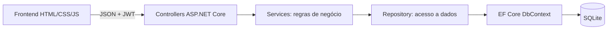

# SmartLib — Biblioteca API

Plataforma de gestão de biblioteca construída com ASP.NET Core. A aplicação controla catálogo, alunos, empréstimos, devoluções e solicitações de empréstimo, com autenticação JWT e autorização por perfil.

## Arquitetura



O projeto usa `Models` para as entidades, `DTOs` para contratos HTTP, `Controllers` para as rotas, `Services` para regras, `Repositories` para persistência, `Data` para EF Core/SQLite, `Exceptions` para `ProblemDetails` e `Migrations` para versionar o esquema.

## Tecnologias

- .NET 10, C# e ASP.NET Core Web API
- Entity Framework Core 10 e SQLite
- JWT Bearer, RBAC e hash de senhas
- OpenAPI 3.1 e Swagger UI
- HTML, CSS e JavaScript com Fetch API

## Execução com Docker (Recomendado)

A aplicação conta com uma arquitetura desacoplada conteinerizada: o front-end é servido via **Nginx** e o back-end via **ASP.NET Core**.

### Pré-requisitos
- [Docker Desktop](https://www.docker.com/products/docker-desktop/) instalado e em execução.

### Subindo os contêineres

Na raiz do projeto (onde está localizado o arquivo `docker-compose.yml`), execute o comando abaixo no terminal:

```powershell
docker compose up -d --build
```

### URLs de Acesso

- **Front-end Web:** [`http://localhost`](http://localhost) (porta 80)
- **Swagger UI:** [`http://localhost:5000/swagger`](http://localhost:5000/swagger)

### Comandos úteis do Docker

- **Acompanhar logs dos contêineres:**
  ```powershell
  docker compose logs -f
  ```

- **Verificar status dos serviços:**
  ```powershell
  docker compose ps
  ```

- **Parar e remover os contêineres:**
  ```powershell
  docker compose down
  ```

## Execução local

Pré-requisitos: .NET SDK 10, Git e a extensão Live Server do VS Code.

```powershell
git clone https://github.com/marcelgs13/Biblioteca-ASPNET.git
cd Biblioteca-ASPNET
dotnet restore
dotnet tool restore
dotnet tool run dotnet-ef database update
dotnet run --launch-profile http
```

A API usa `http://localhost:5293`; o Swagger fica em `http://localhost:5293/swagger` e o health check em `http://localhost:5293/health`.

Para o front-end, clique com o botão direito em `front_end/login.html`, escolha **Open with Live Server** e acesse `http://127.0.0.1:5500/front_end/login.html`.

## Contas de desenvolvimento

As contas abaixo são criadas automaticamente em `Development`. As senhas são armazenadas somente como hash.

| Perfil | E-mail | Senha |
|---|---|---|
| ADMIN | `admin@ifpe.edu.br` | `Admin@123` |
| BIBLIOTECARIO | `bibliotecario@ifpe.edu.br` | `Biblio@123` |
| ALUNO | `aluno@ifpe.edu.br` | `Aluno@123` |

A migration `DadosDemonstracao` também cria um acervo inicial com autores, livros e empréstimos associados ao aluno de teste. Isso permite explorar dashboards, multas, histórico e relatórios logo após a primeira execução.

O ADMIN possui uma dashboard analítica, acesso total e cadastro de bibliotecários; o BIBLIOTECARIO gerencia acervo, alunos e aprova ou rejeita solicitações; o ALUNO consulta o catálogo, solicita empréstimos, vê o próprio histórico e lê suas notificações.

## Variáveis e configurações

| Chave | Finalidade | Padrão local |
|---|---|---|
| `ConnectionStrings__DefaultConnection` | Conexão com o banco | `Data Source=biblioteca.db` |
| `Jwt__Key` | Chave de assinatura do token | Definida em `appsettings.json` para Development |
| `Jwt__Issuer` | Emissor do JWT | `BibliotecaAPI` |
| `Jwt__Audience` | Público do JWT | `SmartLibFrontend` |
| `Jwt__ExpirationMinutes` | Validade do token | `120` |

Em produção, forneça uma chave JWT forte por variável de ambiente e não versione segredos.

## Endpoints

| Método | Endpoint | Acesso | Descrição |
|---|---|---|---|
| POST | `/api/auth/login` | Público | Autentica e devolve o JWT |
| GET | `/api/usuarios/total` | ADMIN | Retorna o total de contas com acesso ao sistema |
| GET | `/api/usuarios/bibliotecarios` | ADMIN | Lista as contas de bibliotecários |
| POST | `/api/usuarios/bibliotecarios` | ADMIN | Cadastra uma conta de bibliotecário |
| GET | `/api/relatorios/livros-mais-emprestados` | ADMIN | Classifica os livros pelo total de empréstimos |
| GET | `/api/relatorios/usuarios-inadimplentes` | ADMIN | Lista alunos com empréstimos atrasados e suas multas |
| GET | `/api/relatorios/historico?dataInicio=&dataFim=` | ADMIN | Consulta o histórico em um período inclusivo |
| GET | `/api/auditoria?page=1&pageSize=20` | ADMIN | Lista ações de alteração com usuário, ação e horário |
| GET | `/health` | Público | Verifica API e conexão SQLite |
| GET | `/api/autores` | Autenticado | Lista autores |
| GET | `/api/autores/{id}` | Autenticado | Obtém autor |
| POST/PUT/DELETE | `/api/autores...` | ADMIN/BIBLIOTECARIO | Gerencia autores |
| GET | `/api/livros?termo=&page=1&pageSize=10` | Autenticado | Busca e pagina o catálogo |
| GET | `/api/livros/{id}` | Autenticado | Obtém livro |
| POST/PUT/DELETE | `/api/livros...` | ADMIN/BIBLIOTECARIO | CRUD do acervo |
| GET/POST/DELETE | `/api/alunos...` | ADMIN/BIBLIOTECARIO | Gerencia alunos e suas contas |
| GET | `/api/emprestimos` | Autenticado | Equipe vê todos; aluno vê os próprios |
| GET | `/api/emprestimos/{id}` | Autenticado | Consulta empréstimo respeitando o perfil |
| POST | `/api/emprestimos` | ADMIN/BIBLIOTECARIO | Registra empréstimo |
| PUT | `/api/emprestimos/{id}/devolucao` | ADMIN/BIBLIOTECARIO | Registra devolução |
| POST | `/api/reservas` | ALUNO | Solicita o empréstimo de um livro |
| GET | `/api/reservas` | Autenticado | Equipe vê todas; aluno vê as próprias |
| PUT | `/api/reservas/{id}/aprovar` | ADMIN/BIBLIOTECARIO | Aprova e cria o empréstimo |
| PUT | `/api/reservas/{id}/rejeitar` | ADMIN/BIBLIOTECARIO | Rejeita uma solicitação aberta |
| PUT | `/api/reservas/{id}/cancelar` | ALUNO | Cancela uma solicitação própria |
| GET | `/api/notificacoes` | ALUNO | Lista notificações do aluno autenticado |

## Regras principais

- O livro possui ISBN, título, descrição, ano, editora, categoria, autor, quantidade e localização; ISBN é único.
- A busca usa `termo`, e a listagem exige paginação com `pageSize` máximo de 100.
- Matrícula e e-mail do aluno são únicos; cada aluno cadastrado recebe uma conta com a senha informada.
- Somente o ADMIN pode listar e cadastrar bibliotecários; as senhas são armazenadas como hash e nunca retornam pela API.
- O empréstimo dura sete dias, reduz o estoque e não pode ser duplicado enquanto estiver aberto.
- Empréstimos vencidos passam para `Atrasado`; a multa é calculada em R$ 2,00 por dia.
- Livros com estoque geram uma solicitação `AguardandoAprovacao`; sem estoque, entram em `AguardandoDisponibilidade` por ordem cronológica.
- A aprovação cria o empréstimo e reduz o estoque; rejeição e cancelamento liberam a vaga para a próxima solicitação.
- Ao surgir disponibilidade, a próxima solicitação da fila aguarda aprovação e gera uma notificação persistida.
- Recursos relacionados não são excluídos, preservando o histórico.
- Operações `POST`, `PUT` e `DELETE` concluídas com sucesso geram auditoria persistida; somente o ADMIN consulta esses registros.

## Testes manuais

Use o front-end, o Swagger (botão **Authorize**, com o JWT do login) ou `BibliotecaAPI.http`. Valide login, `401` sem token, `403` por perfil, busca/paginação, CRUD do livro, solicitação, aprovação/rejeição, atraso/multa, devolução, fila, notificação, relatórios administrativos, auditoria e `/health`.

Docker, Redis e projetos automatizados de teste estão fora desta etapa e serão tratados em fases posteriores.
